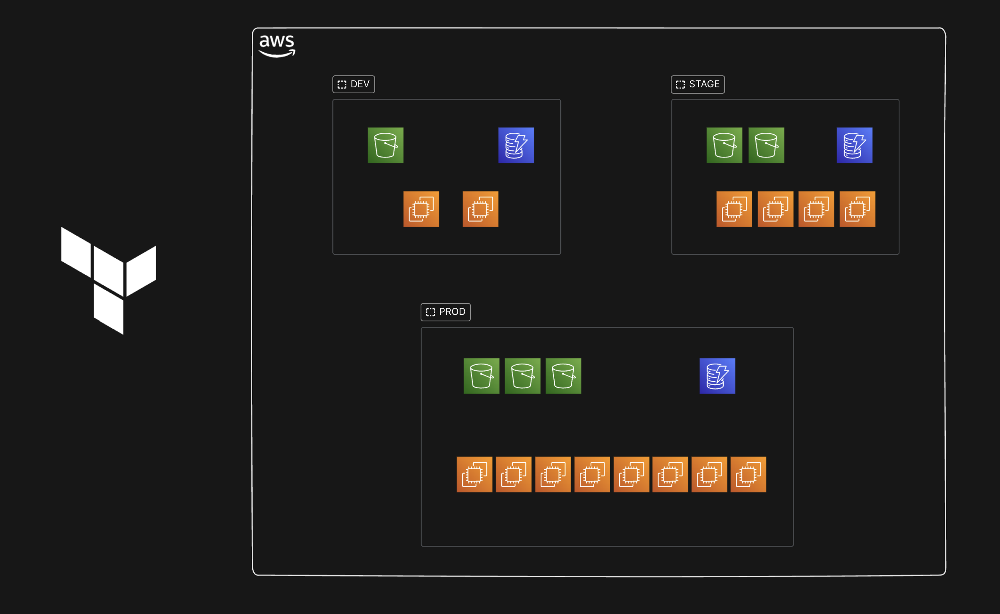

# 🚀 Terraform AWS Infrastructure as Code (IAC)

## 📸 Architecture Diagram

[](https://github.com/Debjyoti2004/terraform-iac-aws)

---

## 📌 Overview
This repository, **terraform-iac-aws**, contains a Terraform configuration to provision and manage AWS cloud infrastructure for different environments:

```
🔹 DEV
🔹 STAGE
🔹 PROD
```

Each environment consists of:

✅ **S3 Buckets** (Storage)  
✅ **EC2 Instances** (Compute)  
✅ **DynamoDB Tables** (Database)  

---

## 📂 Project Structure
```
terraform-iac-aws/
│── README.md              # Project Documentation
│── main.tf                # Root Terraform configuration
│── terraform.tf           # Terraform provider & backend setup
│── aws_infra/             # AWS Infrastructure components
│   ├── bucket.tf          # S3 Buckets Configuration
│   ├── instance.tf        # EC2 Instances Configuration
│   ├── outputs.tf         # Terraform Outputs
│   ├── table.tf           # DynamoDB Tables Configuration
│   └── variables.tf       # Terraform Variables
```


---

## 🛠️ Prerequisites
Before using this repository, ensure you have the following installed:  
```
✅ Terraform: https://developer.hashicorp.com/terraform/tutorials/aws-get-started/install-cli
✅ AWS CLI: https://aws.amazon.com/cli/
✅ SSH Key for authentication
```

---

## 🔑 SSH Key Setup
You need to generate a **public-private key pair** for SSH access. Run the following command:

```
ssh-keygen 
```

🔹 If you want to use a different key name, update `main.tf` by replacing `terrakey` with your custom key name.


---

## 🌍 Deploying Infrastructure

### 1️⃣ Initialize Terraform
```
terraform init
```

### 2️⃣ Validate the Configuration
```
terraform validate
```

### 3️⃣ Preview the Changes
```
terraform plan
```

### 4️⃣ Apply the Configuration
```
terraform apply -auto-approve
```

### 5️⃣ Destroy the Infrastructure (Optional)
```
terraform destroy -auto-approve
```

---

## 📜 Notes

🟢 Terraform State Management: Ensure the Terraform state is stored securely (e.g., in an S3 backend for remote collaboration).
🟢 Security Best Practices: Never commit secrets, access keys, or private SSH keys to the repository.


---

## 📌 Contributing

📢 Contributions are welcome! Please follow the best practices and submit a pull request.


---

## 📄 License

📜 This project is MIT Licensed. Feel free to use and modify it.

